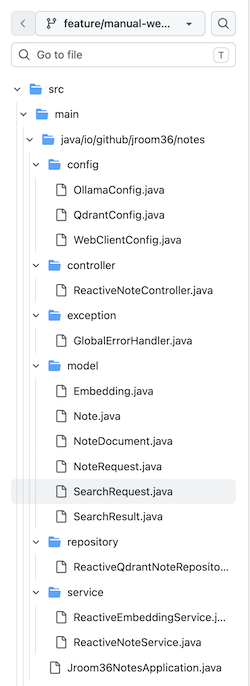
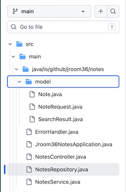

This note is a continuation of the [previous part](https://jroom36.github.io/techs/sematic-search-ai-qdrant-ollama-qwen3-embedding/). The motivation was to compare approaches to implementing the integration with AI:
- Ollama: responsible to calculate embeddings vectors
- Vector database, Qdrant in our case: responsible to keep and search Notes

Let's start with a summary. This conclusion was obvious even before touching the code, but after playing around, it has been confirmed.

Better to start with Spring AI if integration is needed. It provides a good abstraction layer, including:
 - [Embeddings](https://docs.spring.io/spring-ai/reference/api/embeddings.html)
 - [Chat Models](https://docs.spring.io/spring-ai/reference/api/chatmodel.html)
 - [Image Models](https://docs.spring.io/spring-ai/reference/api/imageclient.html)

Spring AI provides starters for more than 20 [vector databases](https://docs.spring.io/spring-ai/reference/api/vectordbs.html).

However, it has some constraints that need to be considered when planning project integration, such as:
 - Spring AI: No WebFlux version for Ollama and Qdrant clients
 - Embedding beans are hidden by Qdrant clients, and vectors are evaluated automatically
 - Qdrant gRPC (port 6334 by default) is enforced, with no way to use the REST API (port 6333)

Even if a custom implementation is preferable for your project, it's better to decouple it from your business logic using your own Spring starter:
- https://docs.spring.io/spring-boot/reference/features/developing-auto-configuration.html#features.developing-auto-configuration.custom-starter
 
## Setting Up Spring AI for jroom36-notes

| Handcrafted WebClient | Spring AI |
|-----------------------|-----------|
| |  |
| REST + Port 6333 | gRPC + Port 6334 |

The old version with the manual WebClient approach is available at:  
https://github.com/alexey-yurganov/jroom36-notes/tree/feature/manual-webclient-calls

The new version with the Spring AI approach is available at:  
https://github.com/alexey-yurganov/jroom36-notes/tree/main

You'll need to update `application.yaml` with the configuration for Ollama and Qdrant:

```
  ai:
    ollama:
      base-url: ${OLLAMA_HOST:http://localhost:11434}
      embedding:
        model: ${EMBEDDINGS_MODEL:qwen3-embedding:4b}
    vectorstore:
      qdrant:
        host: ${QDRANT_HOST:localhost}
        port: ${QDRANT_PORT:6334}
        collection-name: ${QDRANT_COLLECTION:notes}
        content-field-name: payload
        use-tls: false
        initialize-schema: true
```

You'll also need to update the dependencies (`pom.xml`):

```xml
    <dependencyManagement>
        <dependencies>
            <dependency>
                <groupId>org.springframework.ai</groupId>
                <artifactId>spring-ai-bom</artifactId>
                <version>${spring-ai.version}</version>
                <type>pom</type>
                <scope>import</scope>
            </dependency>
        </dependencies>
    </dependencyManagement>

    <dependencies>
        <dependency>
            <groupId>org.springframework.ai</groupId>
            <artifactId>spring-ai-starter-model-ollama</artifactId>
        </dependency>
    ...
    </dependencies>    
```

Custom configuration classes can be removed: `QdrantConfig`, `OllamaConfig`, `WebClientConfig`.  
Custom models like `Embedding`, `NoteDocument`, and `SearchRequest` can also be removed.

Spring AI provides an `EmbeddingModel` bean, which is automatically injected into the `Qdrant` client's `VectorStore`:
- No need for a custom `ReactiveEmbeddingService`; it can be removed.

The `ReactiveQdrantNoteRepository` implementation has been significantly simplified using Spring AI's `VectorStore`.  
`VectorStore` extends two interfaces and provides deletion methods:
- `VectorStoreRetriever` for searching documents: `similaritySearch`
- `DocumentWriter` for writing documents

This is sufficient to implement CRUD operations for the [Repository](https://github.com/alexey-yurganov/jroom36-notes/blob/main/src/main/java/io/github/jroom36/notes/NotesRepository.java).

Spring AI provides `SearchRequest`:
 - With an API to pass a query and threshold: `SearchRequest.builder().query(q).topK(limit).similarityThreshold(threshold).build()`
 - With a `filterExpression` capability, allowing you to search by metadata stored alongside your payload: `SearchRequest.builder().filterExpression(expr).build()`

## Don't Forget to Unblock the Main Loop

Since we're using WebFlux, we need to ensure that non-reactive operations don't block the main event loop. A common pattern for this is:

```java
Mono.fromCallable(...).subscribeOn(Schedulers.boundedElastic())
```

This instruction offloads the call to a separate pool, but it uses the common pool.  
If your application has different types of blocking activities, for example:

- JDBC calls
- Calls to Ollama
- Calls to Qdrant

It's better to use dedicated pools for each type of activity, with appropriate thread policies:

- https://docs.spring.io/projectreactor/reactor-core/docs/3.7.0-M3/reference/html/coreFeatures/schedulers.html

This will protect your application so that embedding vector calculation requests don't block database requests, and users can still access even the main page of your app.

