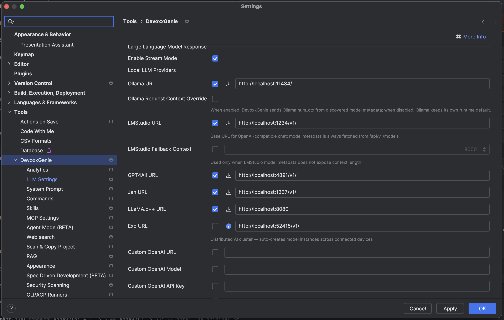
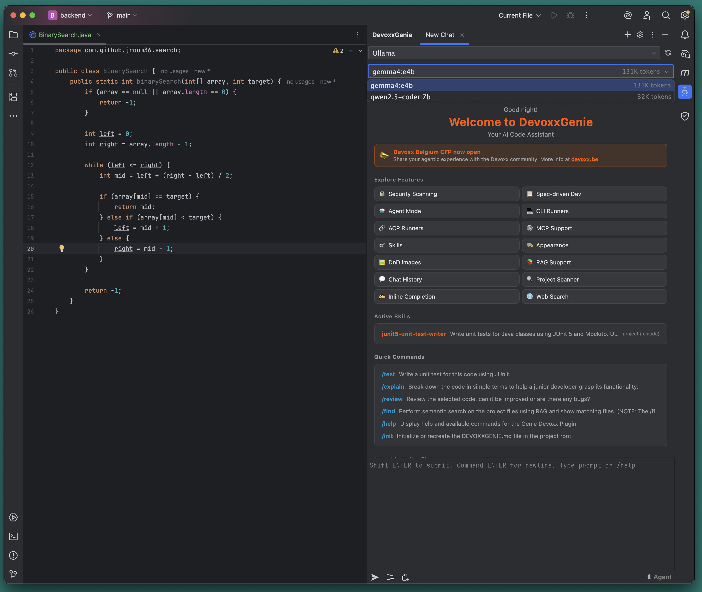

Maintaining high code coverage is essential but often tedious — especially when you need to cover controllers, services, repositories, and edge cases individually. AI‑powered test generation can automate most of this work, cutting hours of manual effort (in some cases, up to 40–50% of testing time).

However, many enterprises — especially in finance, healthcare, or regulated industries — are not willing to share their codebase with third‑party LLM providers like OpenAI or Anthropic. Security policies, intellectual property concerns, and compliance requirements (e.g., GDPR, SOC2) often mandate that no data leaves the corporate network.

This has led to a clear industry trend: running local LLMs in‑house with full air‑gapped isolation. Teams are deploying models like Google's Gemma 4b via Ollama, integrating them directly into IntelliJ IDEA using plugins such as Devoxx Genie, and keeping all code and inferences entirely within their own infrastructure — with no internet required and no recurring API costs.

In this three‑part series, I'll show you exactly how to set this up for a Spring Boot application — from local LLM setup to enterprise‑grade Docker isolation.

## Install Ollama + LLMs

My working machine is a MacBook, so we could use brew:

```bash
brew uninstall ollama
brew install --cask ollama
```
A reinstall ensures that the latest version will be installed, which is compatible with latest format of LLM models

## Local LLMs for Java Development

| Model | Best For | Context Window (Tokens) | Recommended RAM (Q4) | Key Strength / Why it fits Java |
| :--- | :--- | :--- | :--- | :--- |
| **Qwen 2.5 Coder (7B)** | Code Generation & Logic | **128K** | ~5.5 GB | Top HumanEval score (76.0). Excellent at Java streams/logic. |
| **Gemma 4 (e4b / 9B)** | General Java / Balanced | **128K** | ~6–10 GB | Low verbosity. Generates clean, standard Java code. |
| **DeepSeek Coder V2 (16B)** | Complex Refactoring | **128K** | ~10–12 GB | High accuracy (83.5% HumanEval). Best for test generation. |
| **Mistral Small 3 (7B)** | Real-time Autocomplete | **32K** | ~5.5 GB | Very fast (~50 t/s). Ideal for inline suggestions. |
| **Phi-4-mini (3.8B)** | Low-resource machines | **16K** | ~3.5 GB | Very low RAM usage. Runs on 8GB laptops. |

Let's pull a couple of models

```bash
# start ollama
ollama serve
```

```bash
ollama pull qwen2.5-coder:7b
ollama pull gemma4:e4b
```

You could skip qwen2.5-coder:7b - but for my setup it showed more stable results in terms of memory consumption, so you could play with this one as well.

Detailed overview on Gemma4:e4b: 
 - https://huggingface.co/google/gemma-4-E4B
 - https://ollama.com/library/gemma4:e4b

After pulling you could try

```bash
ollama list
```

and results should be like this 

```bash
❯ ollama list
NAME                ID              SIZE      MODIFIED
gemma4:e4b          c6eb396dbd59    9.6 GB    26 minutes ago
qwen2.5-coder:7b    dae161e27b0e    4.7 GB    3 hours ago
```

For `hello world` ping just type:

```bash
ollama run qwen2.5-coder:7b "Hello"
```

and response should be like 

```bash
Hello! How can I assist you today?
```

Near the same for gemma4:e4b

```bash
ollama run gemma4:e4b "Hello"
```
Required more time and after Thinking... it should print near the same:

```bash
Hello! How can I help you today? 😊
```

## Devoxx Genie: Connect IntelliJ IDEA to Gemma4:e4b

There are some alternatives on marketplace to play with local LLM. You'll also hear about Continue.dev and LM Studio.

Continue.dev works across VS Code and IntelliJ, supports local Ollama models, and does RAG. But for Java‑specific workflows (like generating @SpringBootTest or @DataJpaTest with all the right context), Devoxx Genie offers more polished features — including agent mode and spec‑driven development.

LM Studio is a standalone desktop app that runs models locally and exposes an OpenAI‑compatible API — any plugin can talk to it. The trade‑off is shallow IDE integration. You manage prompts and context yourself.

Rolling your own with Ollama's raw API is always possible — but then you're building prompt management, context handling, and result parsing from scratch.

For IntelliJ + Spring Boot, [Devoxx Genie](https://genie.devoxx.com) is a practical choice.

- It works offline
- It works with IntelliJ IDEA Community Edition
- It supports RAG - you could train LLMs on your project and persist resulting vectors in ChromaDB and it could act as tech expert of your App
- It supports SKILLs - various, includes own location, Claude, Agents. No need to adapt your existing codebase in most cases

More details on official plugin page:
https://plugins.jetbrains.com/plugin/24169-devoxxgenie

After installing from market place, you could open plugin settings and ensure that it points correctly on your Ollama setup:



By default Ollama will start on http://localhost:11434/

Additionally you could Enable Stream Mode to be able see dynamic results

## Generate Unit Test with LLM

Let's start with some snippet to test

```Java
public class BinarySearch {
    public static int binarySearch(int[] array, int target) {
        if (array == null || array.length == 0) {
            return -1;
        }
        
        int left = 0;
        int right = array.length - 1;
        
        while (left <= right) {
            int mid = left + (right - left) / 2;
            
            if (array[mid] == target) {
                return mid;
            } else if (array[mid] < target) {
                left = mid + 1;
            } else {
                right = mid - 1;
            }
        }
        
        return -1;
    }
}
```

Let's Open DevoxxGenie plugin in IDEA. We could observe that installed LLMs were discovered and we could select gemma4:e4b or qwen2.5-coder:7b




Open java class with BinarySearch and type in chat to ask for test generation:

```
/test
```

qwen2.5-coder:7b responded by 14.5s with:

```java
package com.github.jroom36.search;

import org.junit.jupiter.api.Test;
import static org.junit.jupiter.api.Assertions.*;

public class BinarySearchTest {

    @Test
    public void testBinarySearchFound() {
        int[] array = {1, 2, 3, 4, 5};
        int target = 3;
        int expectedIndex = 2;
        assertEquals(expectedIndex, BinarySearch.binarySearch(array, target));
    }

    @Test
    public void testBinarySearchNotFound() {
        int[] array = {1, 2, 3, 4, 5};
        int target = 6;
        int expectedResult = -1;
        assertEquals(expectedResult, BinarySearch.binarySearch(array, target));
    }

    @Test
    public void testBinarySearchEmptyArray() {
        int[] array = {};
        int target = 1;
        int expectedResult = -1;
        assertEquals(expectedResult, BinarySearch.binarySearch(array, target));
    }

    @Test
    public void testBinarySearchNullArray() {
        int[] array = null;
        int target = 1;
        int expectedResult = -1;
        assertEquals(expectedResult, BinarySearch.binarySearch(array, target));
    }
}
```

gemma4:e4b responded by 50s with more complex test:

```java
package com.github.jroom36.search;

import org.junit.jupiter.api.Test;
import static org.junit.jupiter.api.Assertions.*;

public class BinarySearchTest {

    @Test
    void testBinarySearchTargetFoundInMiddle() {
        // Array: 1, 2, 3, 4, 5, Target: 3 (Index 2)
        int[] array = {1, 2, 3, 4, 5};
        int target = 3;
        assertEquals(2, BinarySearch.binarySearch(array, target), "Should find the element in the middle.");
    }

    @Test
    void testBinarySearchTargetFoundAtStart() {
        // Array: 1, 2, 3, 4, Target: 1 (Index 0)
        int[] array = {1, 2, 3, 4};
        int target = 1;
        assertEquals(0, BinarySearch.binarySearch(array, target), "Should find the element at the start.");
    }

    @Test
    void testBinarySearchTargetFoundAtEnd() {
        // Array: 1, 2, 3, 4, Target: 4 (Index 3)
        int[] array = {1, 2, 3, 4};
        int target = 4;
        assertEquals(3, BinarySearch.binarySearch(array, target), "Should find the element at the end.");
    }

    @Test
    void testBinarySearchTargetNotFoundSmallerThanAll() {
        // Array: 5, 10, 15, Target: 1 (Index -1)
        int[] array = {5, 10, 15};
        int target = 1;
        assertEquals(-1, BinarySearch.binarySearch(array, target), "Should return -1 when target is smaller than all elements.");
    }

    @Test
    void testBinarySearchTargetNotFoundLargerThanAll() {
        // Array: 5, 10, 15, Target: 20 (Index -1)
        int[] array = {5, 10, 15};
        int target = 20;
        assertEquals(-1, BinarySearch.binarySearch(array, target), "Should return -1 when target is larger than all elements.");
    }

    @Test
    void testBinarySearchTargetNotFoundInBetween() {
        // Array: 1, 3, 5, Target: 4 (Index -1)
        int[] array = {1, 3, 5};
        int target = 4;
        assertEquals(-1, BinarySearch.binarySearch(array, target), "Should return -1 when target is not present.");
    }

    @Test
    void testBinarySearchEmptyArray() {
        // Edge case: Empty array
        int[] array = {};
        int target = 5;
        assertEquals(-1, BinarySearch.binarySearch(array, target), "Should return -1 for an empty array.");
    }

    @Test
    void testBinarySearchNullArray() {
        // Edge case: Null array
        int[] array = null;
        int target = 5;
        assertEquals(-1, BinarySearch.binarySearch(array, target), "Should return -1 for a null array.");
    }

    @Test
    void testBinarySearchSingleElementFound() {
        // Edge case: Single element array, found
        int[] array = {7};
        int target = 7;
        assertEquals(0, BinarySearch.binarySearch(array, target), "Should find the element in a single-element array.");
    }

    @Test
    void testBinarySearchSingleElementNotFound() {
        // Edge case: Single element array, not found
        int[] array = {7};
        int target = 8;
        assertEquals(-1, BinarySearch.binarySearch(array, target), "Should return -1 for a single-element array when target is missing.");
    }
}
```

Also if enable Agent mode in DevoxxGenie - gemma4:e4b could apply changes on file system and could run just created tests.

This was 'hello world' example that showed how we could use local LLM to generate unit tests for Java application.
On real project you most probably will use https://github.com/numman-ali/openskills/ to manage skills. Integrate RAG and ChromaDB to train LLM on exactly approaches used in your project, not abstract testing. And will create separate skills to be able handle different kinds of tests in your enterprise, like:

 - Unit tests with JUnit5 and Mockito
 - @SpringBootTest
 - @DataJpaTest with @Testcontainers
 - @WebMvcTest

In next part we will check how to Isolate LLM with docker and ensure that no sensitive data will be transferred from your project.