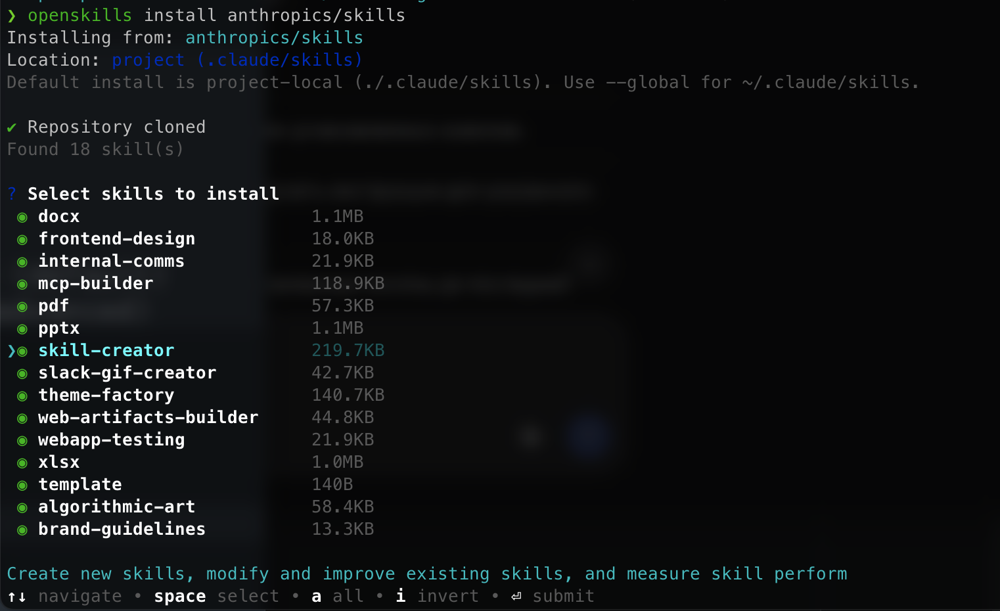
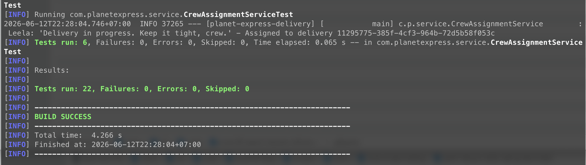
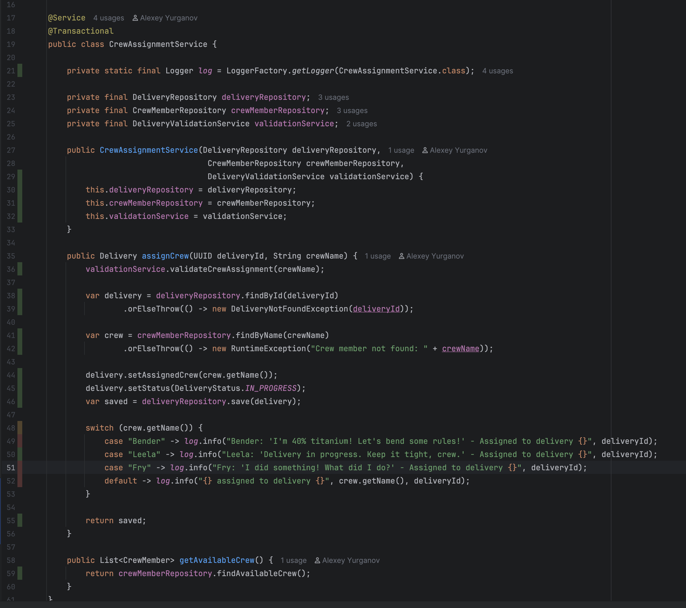
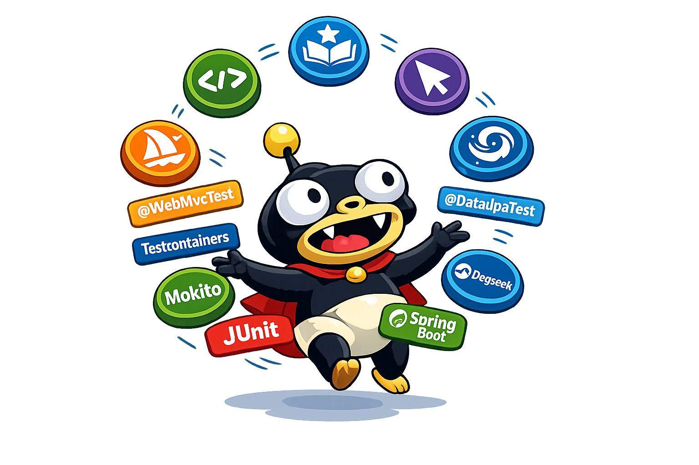

## How to Automate Spring Boot Test Writing for Your Team Using LLMs and Custom Skills

Today we will review how to automate test writing for a team working on a Spring Boot application.

We could ask Cursor/Windsurf/Opencode to create a test just from a prompt. From a developer's experience, this is the fastest way — but companies usually have their own standards, specifics for writing and maintaining the codebase, and best practices/patterns.

And yes, this approach works even without an internet connection. See: [Part 1 — Local LLM setup](https://jroom36.github.io/techs/local-ai-java-testing/part1-ollama-gemma-devoxx-setup/). You can bootstrap your own LLM server and save developer resources.

In the long term, companies should consider RAG + ChromaDB. But for daily use, you can start with Skills.

A company can have a repository with a common set of Skills. If a developer wants to extend it, they create a PR with a new or modified Skill. New team members then get company-level standards out of the box — just like formatters and code styles in previous years.

To manage skills we will use:

https://github.com/numman-ali/openskills/

It allows to install custom Skills from different sources, including git repository. OpenSkill can generate Agents.md, which will already be used on the developer's side by the AI agent.

## Charging app to test

First of all we need this application, and thanks to Deepseek + Opencode + BigPickle and we already have Delivery system for Planet Express:

https://github.com/alexey-yurganov/jroom36-planet-express-delivery/tree/main

This is common Spring App with Data layer, Service Layer and REST API layer. We will create some tests on it.

### Test Types

We plan to cover application with common types of tests:

- @WebMvcTest - for REST API Controllers
- @DataJpaTest - for Spring repositories
- @Testcontainers - for integration tests
- Mockito&Junit - for services

## Create Skills

Let's install OpenSkills to be able manage our set of skills:

```bash
npm i -g openskills
openskills list
```

For a first time, the response should look like:

```
❯ openskills list
Available Skills:

No skills installed.

Install skills:
  npx openskills install anthropics/skills         # Project (default)
  npx openskills install owner/skill --global     # Global (advanced)
```

Next one, let's install common skills from anthropics

```
openskills install anthropics/skills
openskills sync
```

In interactive mode you could explore/select available Skills in this repo, by default all items are selected. We are interested in one specific skill named as:

 - skill-creator - it will help create our own skills in common way



Because each dev could have different set of skills and from different repos this should not be part of SCM/git.

### Skills & Unit Test for Spring Boot: Services, Controllers, Data

I use OpenCode but any agent could be used. Need to open project where skill `skill-creator` had been installed and ask from prompt

```
Use skill-creator for creating skill which allow to create Unit tests for Spring Boot Services
```

OpenCode asked for some parameters. For this round, we will create a common skill to cover possible test types but technically you could split on separate skills and support them independently.

Skill created: spring-boot-testing
Location: .claude/skills/spring-boot-testing/

```
spring-boot-testing/
├── SKILL.md                     — Orchestration + workflow
├── LICENSE.txt
├── .openskills.json
└── references/
    ├── best-practices.md        — Naming, AAA, AssertJ, verification checklist
    ├── service-testing.md       — @ExtendWith + @Mock + @InjectMocks patterns
    ├── repository-testing.md    — @DataJpaTest + TestEntityManager
    ├── controller-testing.md    — @WebMvcTest + MockMvc + @MockBean
    └── integration-testing.md   — @SpringBootTest + Testcontainers
```

Now we could commit and push skill into repo, for example:

https://github.com/alexey-yurganov/spring-boot-testing-skills/tree/main/spring-boot-testing


### Create test using `spring-boot-testing` skill

We could install skill into our project and generate some test:

```
openskills install alexey-yurganov/spring-boot-testing-skills/spring-boot-testing

❯ openskills install alexey-yurganov/spring-boot-testing-skills/spring-boot-testing
Installing from: alexey-yurganov/spring-boot-testing-skills/spring-boot-testing
Location: project (.claude/skills)
Default install is project-local (./.claude/skills). Use --global for ~/.claude/skills.

✔ Repository cloned
✅ Installed: spring-boot-testing
   Location: /Users/lx2/code/jroom36-planet-express-delivery/.claude/skills/spring-boot-testing

openskills sync
```

After that you could ensure that it is done and skill is available:

```
❯ openskills list
Available Skills:

  spring-boot-testing       (project)
    Comprehensive guidance for writing unit and integration tests for Spring Boot applications. Use this skill whenever the user asks to write tests for Spring Boot components, generate test classes, mock Spring beans, set up test slices (@WebMvcTest, @DataJpaTest, @JsonTest), use Testcontainers for integration tests, or asks about Spring Boot testing best practices, JUnit 5, Mockito, or AssertJ in the context of Spring Boot. Also trigger when the user mentions covering service/business logic with tests, testing JPA repositories, testing REST controllers, or wants to add tests to an existing Spring Boot project — even if they don't explicitly say "Spring Boot" (look for Maven/Gradle projects with spring-boot-starter dependencies). Do NOT trigger for non-Spring Java testing (plain JUnit without Spring), frontend testing, or end-to-end testing with tools like Selenium or Cypress unless Spring Boot is the backend under test.

Summary: 1 project, 0 global (1 total)
```

Time to create some test. For example we have Service 

https://github.com/alexey-yurganov/jroom36-planet-express-delivery/blob/main/src/main/java/com/planetexpress/service/CrewAssignmentService.java


let's ask OpenCode to create test for this, type this into the prompt of your Agent (OpenCode in my case)

```
Using skill spring-boot-testing create test for CrewAssignmentService
``` 

The test was created. If you run the command to execute all tests, you can verify that they pass successfully:

```
make test
```


Generated test could be reviewed here:

https://github.com/alexey-yurganov/jroom36-planet-express-delivery/blob/main/src/test/java/com/planetexpress/service/CrewAssignmentServiceTest.java

Lets see code-coverage (85%):



### Observations and Limitations
- Yes, there are some hardcoded strings — but this is due to the original codebase we used for testing.
- Yes, some scenarios could be added to handle all branches and improve code coverage.
- Yes, it could use a logger via @Log.

There are other parts that could be enhanced based on your team's rules. Next time, the generated tests will be free of these issues.

Homework: try to generate tests for Repositories and Integration tests, it is not committed and should not force conflicts.

## Summary

In this article, we showed how a team can systematically automate Spring Boot test writing using AI and OpenSkills.

### Key points

1. **Plain prompts** are fast but inconsistent across developers.
2. **Custom Skills** encode your company's best practices and apply them automatically.
3. **OpenSkills** lets you manage Skills as code — install, sync, review via PRs.
4. **No internet? No problem.** You can use local LLMs (see [Part 1](https://jroom36.github.io/techs/local-ai-java-testing/part1-ollama-gemma-devoxx-setup/)).
5. **Real example:** We generated a test for `CrewAssignmentService` with **85% code coverage** — and immediately identified areas for improvement (hardcoded strings, logging, missing branches).

### Homework from the article

- Generate tests for Repositories and Integration tests
- Adapt generated tests to your team's internal standards
- Ensure no conflicts with existing code

### Final thought

A custom Skill is **not just a prompt template**. It is:

- ✅ An **executable coding standard** — rules applied automatically, not just documented
- ✅ A **knowledge distribution system** — update once, everyone gets the new standard
- ✅ An **integration hub** — can call CI/CD pipelines, SonarQube, Jira, or internal APIs

This approach lowers the onboarding barrier for new developers, speeds up code reviews, and makes tests predictable and maintainable.


